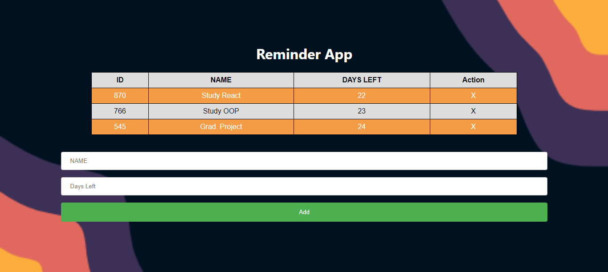

# React Reminder App
> React , Components , ADD , Delete Operation , Responsive to small screens  ( with no media queries ) 

<p align="center">
  
</p>


**Live demo:** https://react-reminder-app-seven.vercel.app

A small React app (built with [Vite](https://vite.dev) and React 19): add a reminder with the number of days
left, see all reminders in a table, and delete them when done. State lives
in memory (reminders reset on reload).

## Getting started

Requires Node.js 22.12+ (the dev server and build also run on 20.19+; the Vitest test runner needs 22.12+).

```bash
npm install
npm run dev      # dev server on http://localhost:3000
```

## Scripts

| Command | What it does |
| --- | --- |
| `npm run dev` (or `npm start`) | Start the Vite development server |
| `npm test` | Run the Vitest + Testing Library tests (watch mode; `npm test -- --run` for a single run) |
| `npm run lint` | Lint with ESLint (flat config, CRA rule set) |
| `npm run build` | Production build into `build/` |
| `npm run preview` | Serve the production build locally |
